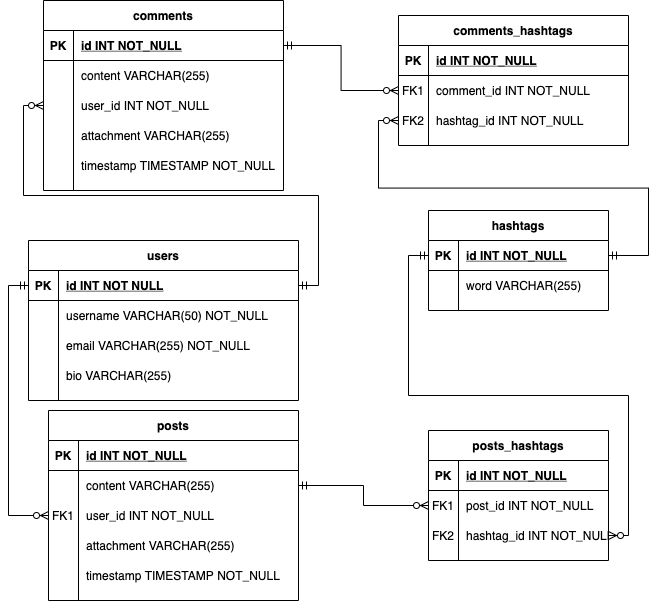

# Social Media Application

This is an API-only application. This is created for Generasi Gigih final project.

## Problem Description

This app handles simple activity in social media. This app able to handle:

- User registration. User can save username, email and bio description. (Authentication and authorization not included)
- User can post a post that might contains hashtag(s). The post is limited to 1000 characters. The hashtags use '#word' format
- User can see posts filtered with a hashtag
- User can see the list of trending hashtags. Trending hashtags are 5 most posted hashtags in the past 24 hours (including comment post).
- User can comment on a post
- Post and comment can contain a file attachment

## Database Schema



## Folder Description

```
├── backend : the root folder where the app is running
│   ├── controllers : contains controller file that manage  model and  view
│   ├── db : contains sql file for database and file to integrate the app with mysql
│   ├── helper : function for file handling
│   ├── models : represent the app data model
│   ├── spec : test script (spec file) for controller and model
│   ├── uploads : to store user attachments
│   └── views : contains file that manages the response view for the API
└── doc
    ├── Postman Collection : contains a postman collection that can be run to test the API
    │   └── env domain : domain url that can be used to run the post man. There are two domain, use development env to make the localhost:4567 as the domain
    └── db_schema.png : ER diagram of database used in backend app
```

## Prerequisite

- Install Ruby (using [rbenv](https://github.com/rbenv/rbenv) is recommended
- Install mysql
- Configure database
  - create empty database
  - import database from backend/db/social_media_db.sql to the created database

## How to Run

1. Open terminal, move your current working directory to backend first. It is important because 'backend' folder is the root folder for the app
   ```
   cd backend
   ```
2. Install the dependency (sinatra, mysql2 0.5.2, simplecov, rspec). You can instal one by one using gem install command or just install using [bundler](https://bundler.io/)

   ```
   gem install bundler
   ```

   ```
   bundle install
   ```

3. Add .env file with the .env.template structure. Adjust the variable field to your own environment. For local environment the DB_HOST could be 127.0.0.1 or localhost. Source the .env file for the env variables.

   ```
   source .env
   ```

4. Run test suites using rspec
   ```
   rspec -f d
   ```
5. Run app
   ```
   ruby app.rb
   ```
6. Test postman collection
   - Import the collection (doc/Postman Collection) to postman
   - Import the postman environment. You may adjust the env according your environment.
   - Send the API request
